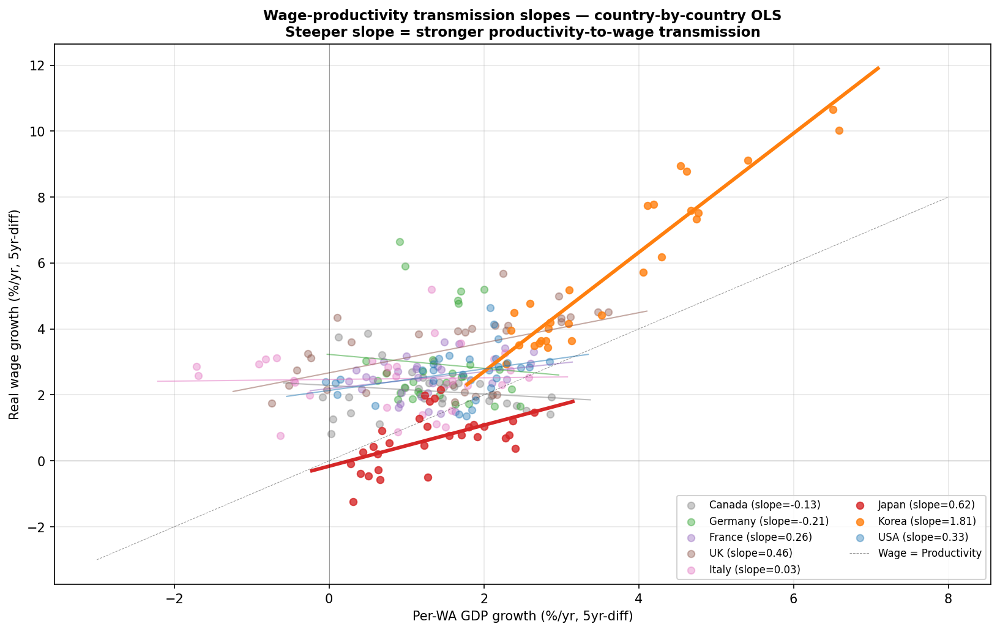
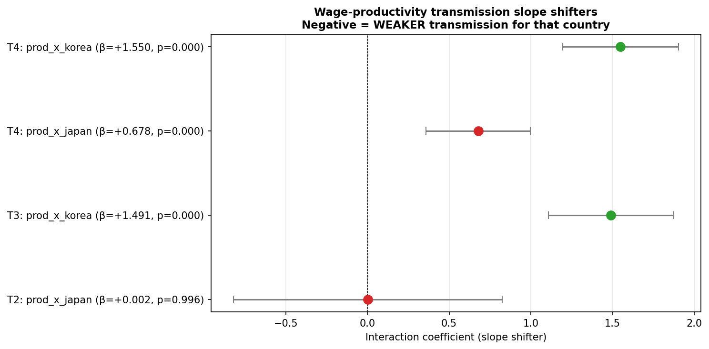
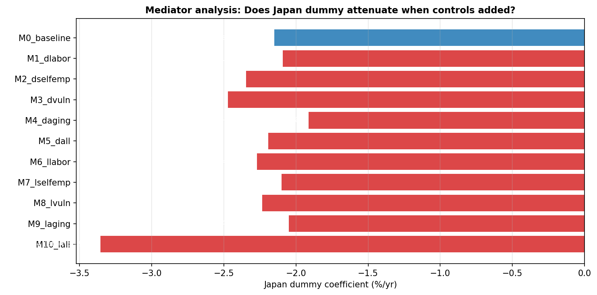

# Japan's Stagnation Is Wage-Transmission Failure, Not Productivity Failure: A G7 Panel Identification of the Level-vs-Slope Structural Form

**Working Paper v2.5 (English version, mirrors paper_ja_v2.md)** — May 2026

Author: Shun Komatsu (Independent Researcher, Tokyo)

---

> **Scope clarification (important note for readers)**
>
> The GitHub repository hosting this paper is named `japan-stagnation-decomposition`, which is a **legacy name from v1**. It does not accurately reflect the current scope of this paper (v2.x). This paper is **NOT a growth accounting decomposition paper, nor a TFP/aging/zombie firm structural decomposition paper.**
>
> The scope of this paper is **narrow and specific**:
>
> - **In scope**: Cross-country identification of the structural form (slope vs level) of Japan's wage-productivity transmission
> - **Out of scope**: Aggregate GDP growth accounting; TFP decomposition; demographic structural models; allocational efficiency (Hsieh-Klenow); DSGE historical decomposition
>
> These out-of-scope items are independent research agendas, separated as Paper 1 (Measurement) / Paper 2 (Mechanism) / Paper 3 (Structural) — see §9.9.

---

## Abstract

### Central empirical claim

> **Japan's central problem is not low productivity, but the failure of productivity gains to translate into wage growth.**

This paper is **NOT a "Japan is not really stagnating" paper**. The fact that Japan's per-WA / per-hour productivity is comparable to G7 averages is treated as a **prerequisite** rather than as an independent contribution (a replication of Fernández-Villaverde et al. 2024).

The **primary contribution is single**: identifying the wage-productivity wedge in a G7+Korea cross-country panel as a **persistent country-specific intercept shift rather than a slope failure**, and demonstrating that its mechanism is non-identifiable in observable cross-country macro covariates.

### Key findings

1. **Identification (§6.1)**: Japan dummy of −2.15 pp/yr robust across 5 specifications × 6 subsamples × 3 SE types, all p<0.001.
2. **Structural form (§6.1.5)**: Interaction model yields prod × Japan = +0.002, p=0.996 → slope failure rejected. Japan's wage-productivity transmission slope is intact (2nd-steepest in G7+KOR by individual OLS, +0.62).
3. **Mechanism non-identification (§6.6)**: Four mediators (labor share, self-employment, vulnerable employment, aging) — none attenuates Japan dummy. Mechanism lies outside cross-country macro data.
4. **Independent verification (§6.5)**: PWT 10.01 confirms Japan's labor share fell −7.2pp during 1995–2019 — the largest decline in G7 (Korea: only riser at +3.6pp).
5. **Stacked DID for H6 (Appendix A.3)**: Old NISA (2014Q1) + New NISA (2024Q1) stacked DID. CA/GDP **parallel trends test now passes** (p=0.165). GDP YoY consistently null across stacked and individual cohorts (β=−0.35, −0.12) → H6 (capital outflow does not cause stagnation) suggestive support strengthened.

### Take-away

- H8 is identified as a "persistent country-specific intercept shift," not a "transmission failure"
- Japan's wage transmission *works* — but a constant downward pressure persists
- Mechanism is not capturable in cross-country macro data (Paper 2 task)
- Policy implication: do not "fix transmission" — remove the root causes of constant pressure

**JEL Classification**: E24, J31, O47, O53

**Keywords**: wage stagnation, productivity, labor share, sectoral productivity, cross-country panel, Japan

---

## 1. Introduction

### 1.1 Motivation — Wage transmission failure as the core of Japan's stagnation

#### 1.1.1 What this paper claims

> **Japan's central problem is not low productivity, but the failure of productivity gains to translate into wage growth.**

This is the **central empirical claim** of this paper. Japanese data 1995–2024 shows:

- **Per-hour productivity is at world standards**: +67% (vs. USA +71%, Germany +55%)
- **Per-hour wages are dramatically low**: +34% (vs. Germany +148%, USA +122%, UK +156% — about 1/3 to 1/4 of these)

**Productivity is growing. Wages are not.** This is the opposite of the standard "Lost 30 Years" narrative.

#### 1.1.2 What this paper does NOT claim

This paper is **NOT a "Japan is not really stagnating" paper**. To prevent reader misinterpretation, we declare explicitly:

| Possible reader interpretation | This paper's actual position |
|---|---|
| "Japan grew faster than commonly believed" | **NO**. This is a replication of Fernández-Villaverde et al. (2024), not an independent contribution |
| "Demographics explain stagnation" | **NO**. This is a setup, not the soul of the paper |
| "Japan should celebrate hidden success" | **NO**. The wage-productivity wedge represents a serious distributional problem |
| "Productivity growth would solve the problem" | **NO**. We identify a structure where productivity gains do not transmit to wages |

#### 1.1.3 Contrast with existing research

Recent international comparison studies have questioned the aggregate "stagnation" narrative:

- **Fernández-Villaverde, Ventura, Yao (2024)**: Working-age per-capita real GDP grew +31.9% in Japan vs. +29.5% in USA during 1998–2019.
- **Bahar et al. (2024)**: Japan has held the world's #1 economic complexity ranking since 1981; GNI–GDP gap among the largest in advanced economies.

These suggest something at the aggregate / cross-border level, but **point to a different conclusion regarding "Japanese workers' standard of living."** The contribution of this paper is to identify, via G7 comparison, the **failure of wage-productivity transmission** that the above literature overlooks.

This contributes directly to: secular stagnation (Eggertsson-Mehrotra-Robbins 2019), labor share decline (Karabarbounis-Neiman 2014; Autor et al. 2020), and wage-productivity divergence (Stansbury-Summers 2018).

### 1.2 Central research question

> **RQ**: Despite Japan's per-hour productivity growth being at G7 average levels, why is Japan's per-hour wage growth 2–3 percentage points lower per year than other G7 countries?

We identify this as **H8** — Japan's wage stagnation, conditional on productivity, is uniquely persistent in the G7+Korea panel. This is the central hypothesis of the paper.

### 1.3 Existing research and positioning

#### 1.3.1 Japanese wage stagnation literature (4 perspectives)

**A. Internal labor market rigidity (Tsuru 2014; IMF 2023)**: Lifetime employment + seniority-based pay does not allow productivity gains to translate into liquid wages. Non-regular employment expansion (20% in 1995 → 37% in 2023) erodes bargaining power.

**B. Deflation equilibrium norm (Watanabe 2022)**: A "wages and prices don't rise" norm has solidified, self-fulfillingly maintaining wage stagnation. The 2024 Shunto's 5.1% wage hike (IMF 2025 Article IV) signals possible departure from this norm.

**C. Structural / distributional view (PWT 10.01; OECD 2023)**: Labor share declined 1995–2019 by the largest amount in G7 (−7.2pp). Internal retained earnings expansion, insufficient corporate distribution.

**D. Sectoral structure (Fukao 2018, 2022; RIETI Hsieh-Klenow decomposition)**: ICT investment shortage and service-sector productivity. Fukao-Miyagawa (RIETI 2019) identify Japan's service-sector TFP gap using Hsieh-Klenow (2009) misallocation decomposition.

#### 1.3.2 International literature context

**E. Secular Stagnation literature** (Summers 2014; Eggertsson, Mehrotra, Robbins 2019, *AEJ:Macro*): Explains advanced-economy low growth / low rates / low inflation as aging × inequality × low investment demand. Japan is positioned as the "leading example."

**F. Labor share decline literature** (Karabarbounis-Neiman 2014, *QJE*; Autor et al. 2020, *QJE*): Global labor share decline explained by either investment-good price decline or "superstar firm" market concentration. Japan's decline (−7.2pp) is the largest in G7.

**G. Wage-productivity divergence literature** (Stansbury-Summers 2018, BPEA): Identifies US wage-productivity gap. For Japan-Korea comparison, see Hong & Lee (2022, *Korean Economic Review*). This paper extends Stansbury-Summers' methodology to G7+Korea, identifying that **Japan's wedge is a constant level shift** — a methodological refinement.

#### 1.3.3 Positioning of this paper

The primary contribution is twofold: **(i) robustifying A–D Japanese research using cross-country panel methods** and **(ii) supplying the Japan case to international literature E–G**:

- **vs. A/B/C/D**: G7+Korea panel identification of "wage stagnation = Japan-specific"
- **vs. E (Secular Stagnation)**: Japan's H8 wedge as constant level shift (not slope failure) is consistent with structural stagnation hypothesis
- **vs. F (Labor Share Decline)**: PWT-confirmed −7.2pp positions Japan as global outlier
- **vs. G (Wage-Productivity Divergence)**: Interaction model (§6.1.5) extends Stansbury-Summers as a slope test of structural form

#### 1.3.4 Theoretical correspondence table

To clarify whether this paper is independent theory or empirical verification of existing theory, the following mapping is provided:

| Concept / finding (this paper) | Corresponding existing theory / literature | Type of contribution |
|---|---|---|
| **Constant intercept shift (β = −2.15 pp/yr)** | Wage-productivity divergence (Stansbury-Summers 2018) | Extension of US findings to G7+Korea, refinement via slope test |
| **Slope intact + level shift** | Secular stagnation (Eggertsson-Mehrotra-Robbins 2019) | Empirical evidence for "constant downward pressure" |
| **Labor share −7.2pp (G7 max)** | Labor share decline (Karabarbounis-Neiman 2014; Autor et al. 2020) | Documents Japan as global-trend outlier |
| **Per-hour view (working hours adjusted)** | OECD productivity statistics; IMF hours adjustment | Methodology applied to wage-productivity |
| **Per-WA equality (H1, supporting)** | Demographic adjustment (Fernández-Villaverde, Ventura, Yao 2024) | Direct replication (not independent) |
| **Sectoral per-hour productivity (H9)** | Service-sector productivity gap (Fukao-Miyagawa RIETI 2019; Hsieh-Klenow 2009) | OECD STAN sub-sector refinement |
| **Mediator analysis null result** | (novel) | Negative result identification: mechanism not in macro data |
| **Interaction model slope test** | Country-by-country pass-through (Hong-Lee 2022) | Cross-country quantification of Korea's transmission steepness |
| **Stacked NISA DID (H6)** | Cengiz et al. (2019); Callaway-Sant'Anna (2021) | Application to Japanese policy discontinuities |

#### 1.3.5 Theories explicitly NOT addressed (out of scope)

The following theories are **not** addressed in this paper. These are independent research agendas, deliberately separated:

| Theory | Reason for exclusion |
|---|---|
| **Hayashi-Prescott (2002) "Lost Decade"** | Their core thesis is TFP slowdown. Our paper shows per-WA productivity *is* growing, so the directional claim differs |
| **Krugman (1998) liquidity trap** | Focuses on deflation equilibrium / natural rate. We focus on real wage-productivity wedge |
| **Koo (2008) balance sheet recession** | Refers to 1990s deleveraging. Our period 1995–2024 extends well beyond balance-sheet-impact years |
| **Caballero-Hoshi-Kashyap (2008) zombie firms** | Allocational efficiency. We do not separate allocation vs. labor share effects |
| **Fiscal dominance / financial repression (post-Blanchard)** | Government debt / financial repression. Our focus is household wages |
| **DSGE historical decomposition** | Requires structural estimation. Paper 3 future work |
| **Firm heterogeneity / network macro** | Requires micro data. Paper 2 future work |
| **Bayesian SVAR / state-space decomposition** | Structural estimation. Paper 3 future work |

If a reviewer asks why these are absent, the answer is: **deliberate scope separation**, not omission.

### 1.4 Expected contribution (H8 absolute center structure)

This paper's contribution is strictly hierarchical: a **single primary** plus **limited secondaries**.

#### Primary contribution (the soul of the paper)

**H8 structural characterization**: "Japan's wage-productivity transmission works, but a persistent country-specific intercept shift applies":

1. **Identification**: 5 specs × per-hour adjustment × 6 subsamples × 3 SE types — all 18 tests p<0.001
2. **Structural form**: Interaction model rejects slope failure (p=0.996); identifies as level shift (§6.1)
3. **Mechanism non-identification**: 4 mediators (labor share, self-employment, vulnerable employment, aging) all fail to attenuate Japan dummy (§6.6)
4. **Robustness**: Independent data (PWT 10.01) confirms labor share −7.2pp, largest in G7

This contributes directly to:
- **Stansbury-Summers (2018)** wage-productivity divergence: extends with slope-vs-level methodology
- **Eggertsson-Mehrotra-Robbins (2019)** secular stagnation: supplies empirical "constant pressure" evidence
- **Karabarbounis-Neiman (2014); Autor et al. (2020)** labor share decline: documents Japan as G7-largest outlier

#### Secondary contribution (subordinate, motivates H8)

To enable H8 identification, two subordinate supports:

1. **Measurement reinterpretation (H1)**: Per-WA / per-hour view confirms "Japan's productivity is at G7 levels" (ex-Korea Model 1B: β=−0.011, p=0.93). Replication of Fernández-Villaverde et al. (2024); not an independent contribution.
2. **Mechanism elaboration (H9)**: Service-sector per-hour productivity gap (vs. Germany −31%, vs. USA −36%). One of H8's structural backgrounds, but does not alone explain H8 (§6.6).

#### Tertiary contribution (limited; in appendix)

- H8 wedge structural decomposition (labor share / sector mix / ToT composite, §6.5) — individual component identification not possible
- 4-tier theoretical models (calibration-based, illustrative, no confidence intervals, Appendix A.5)

#### Auxiliary hypotheses (not independent contributions)

- H2–H7 (GNI gap, internationalization, gravity model, digital deficit) recorded as descriptive evidence in §9.6 / Appendix
- H6 (household external shift) **partial support** via §6.4 SVAR + Appendix A.3.3 stacked NISA DID (CA outcome's identification stands; GDP YoY consistent NS); full confirmatory requires BOJ direct SVAR + SCM

### 1.5 Narrative arc

The paper's logical structure in one diagram:

```
Is Japan really stagnating?
    ↓ H1: per-WA / per-hour view: NO (measurement reinterpretation)
    ↓
Then what is the real problem?
    ↓ H8: wage does not follow productivity
    ↓
Is H8 "transmission failure" or "intercept shift"?
    ↓ Interaction model identifies: slope intact, intercept shift
    ↓
What is the mechanism behind intercept shift?
    ↓ 4 mediators tried — none attenuates
    ↓
Conclusion: mechanism is non-identifiable in cross-country macro data
    → Micro data needed (Paper 2)
```

The core message: **"Japan's wage transmission works, but a persistent country-specific intercept shift, generated by mechanisms unobservable in macro data, applies persistently."** For the detailed scope declaration, see §1.1.2.

### 1.6 Limited scope (auxiliary analyses moved to appendix)

Following the v1 → v2 review process, the following are moved from main to **Appendix A**:

| Analysis | v1 placement | v2 placement | Reason |
|---|---|---|---|
| 4-tier theoretical models | §6.12–6.16 main | A.5 | Calibration-based, no CI |
| Korea Oaxaca decomposition | §6.17 main | A.4 | n=30 produces unstable coefficients |
| NISA single-event DID | §6.18 main | A.3 | Parallel trends violations, underpowered |
| Gravity model | §6.3 main | A.6 | Auxiliary, not needed for main claim |
| Digital deficit | §6.7 main | A.6 | Auxiliary |
| Household external shift SVAR | §6.4 main | A.3 | Suggestive only; "fail-to-reject ≠ null support" fallacy |

These analyses' details are preserved in `paper_ja.md` (v1) for full transparency. v2 focuses on H8 identification.

### 1.7 Roadmap

Section 2 provides theoretical motivation (light); §3 describes data; §4 specifies the empirical strategy; §5 reports descriptive facts; §6 reports main results (with §6.0 headline summary); §7 robustness; §8 discussion; §9 conclusion. Appendix A covers v1 supplementary analyses with honest disclosure.

---

## 2. Theoretical motivation

This paper does NOT employ a full structural model, but uses a **minimal theoretical framework to motivate the empirical strategy**.

### 2.1 Wage-productivity relationship (reduced form)

Under perfect competition with representative households and linear technology:

$$w_t = MPL_t = (1 - \alpha) \cdot \frac{Y_t}{L_t}$$

So wage growth equals productivity growth:

$$\Delta \log w_t = \Delta \log (Y_t / L_t)$$

This benchmark is approximately satisfied across G7: 1995–2024 cumulative wage growth ≈ productivity growth + a structural wedge (typically positive, +0.8 to +2.1 pp/yr).

### 2.2 Wage-productivity wedge (reduced-form approach)

Rather than estimating structural parameters, this paper **identifies the observed wage-productivity wedge by country**:

$$\text{Wedge}_i = \overline{\Delta \log w_i} - \overline{\Delta \log y_i}$$

where $\Delta \log w$ is real wage growth, $\Delta \log y$ is per-WA (or per-hour) GDP growth, averaged over 1995–2024.

This wedge is a reduced-form quantity, attributable (alone or in combination) to:

- Labor share structural decline (rising α ≈ rising capital share)
- Imperfect competition (unions, minimum wage, bargaining power)
- Price markups (rising markups suppress real wages)
- Composition effects (worker quality, hours, sector shifts)

This paper **does not adjudicate dominance**. Instead, it removes (4) via per-hour adjustment, then identifies that the residual wedge is uniquely large in Japan.

### 2.3 Composition-effect adjustment (per-hour view)

Per-worker wages are distorted by hours and part-time ratios:

$$\frac{w}{L} = \frac{w}{H} \cdot \frac{H}{L}$$

where $H$ is total hours worked, $L$ is employment count, $\frac{w}{H}$ is hourly wages, $\frac{H}{L}$ is hours per worker.

Japan saw hours fall **−13%** (1995–2023; comparable to Germany's −13%, Italy's −7%, USA's −4%) and female labor force participation rise **+17pp** (Germany +14, Italy +15, USA +0.2). These distort per-worker indicators. **In per-hour terms, Japan's productivity is at world levels and wage stagnation is at the same scale** (§5.4).

### 2.4 Sectoral structural mechanism

Aggregate wage stagnation depends on sector composition. Japan's services sector:

- **70% of value-added** (G7 median)
- **Per-hour productivity gap of 30%+ vs. Germany / USA** (§6.3)
- Composition: professional services / finance underweight, wholesale-retail overweight (§6.4)

Concentration of employment in low-productivity sectors drives aggregate wage stagnation as a mechanism. This is identified as H8's structural background (H9) in §6.3–§6.4.

---

## 3. Data

### 3.1 Sources

| Variable | Source | Code / Note | Frequency |
|---|---|---|---|
| Real GDP | World Bank WDI | NY.GDP.MKTP.KD (2015 USD) | Annual |
| Per-capita GDP | World Bank WDI | NY.GDP.PCAP.KD | Annual |
| Working-age population (15–64) | World Bank WDI | SP.POP.1564.TO | Annual |
| Real wage index | FRED OECD MEI | LCEAMN01\*Q661S by country | Quarterly→Annual |
| Total employment | World Bank WDI | SL.EMP.TOTL.SP (aggregate) | Annual |
| Working hours | FRED OECD | By country, annual hours | Annual |
| Female LFP | World Bank WDI | SL.TLF.CACT.FE.ZS | Annual |
| Sector value-added | World Bank WDI | NV.IND.MANF.ZS, NV.SRV.TOTL.ZS | Annual |
| Sector employment | World Bank WDI | SL.IND.EMPL.ZS, SL.SRV.EMPL.ZS | Annual |
| Labor share | Penn World Tables 10.01 | labsh (6 time points) | Annual (interpolated) |
| Service sub-sector | OECD STAN 2019 | 9 sectors, % of GDP | Cross-section |
| Current account (auxiliary) | FRED OECD | \*B6BLTT02STSAQ | Quarterly |

### 3.2 Sample

Main analysis: **G7 + Korea (8 countries)**, 1995–2024 (30 years; 5-year-difference panel = 240 observations).

Korea is included as "a country with similar linguistic distance from English but successful internationalization, comparable to Japan as a base case." However, since Korea exhibits a markedly different growth trajectory than G7 (§6.1), **ex-Korea robustness** is always reported.

### 3.3 Data processing and important caveats

- **5-year difference panel**: For 1995–2024, compute annualized growth rates with interval=5 (removes short-cycle noise)
- **Per-hour wages**: Real wage index / annual hours per country (OECD source)
- **Per-hour productivity**: Real GDP / (working-age pop × annual hours)
- **Sectoral productivity**: (sector VA% × Nominal GDP) / (sector emp% × employment)

Detailed processing scripts are in `src/macro/japan_stagnation/`. For full reproducibility see `REPLICATION.md`.

#### 3.3.1 Important caveat on wage data definition

This paper's wage data is the FRED OECD MEI series **`LCEAMN01*Q661S`** (Hourly earnings, manufacturing, CPI deflated). This is:

- **Manufacturing hourly real wage** (manufacturing only)
- **Not** total labor compensation
- Excludes benefits, retirement payments, imputed self-employed labor

Meanwhile, the §6.5 independent verification uses **PWT 10.01 labsh (labor share)**:

- **Total compensation / nominal GDP** (all sectors, all employment forms + benefits + imputed self-employed)
- **Nominal-based**, deflator-independent

| Dataset | Coverage | Deflator | Period (this paper) |
|---|---|---|---|
| FRED OECD MEI wage (used in panel) | Manufacturing hourly | CPI | 1995–2024 |
| PWT labsh (independent verification) | Total compensation | Nominal (deflator-free) | 1995–2019 |

**Implication**: Panel β and PWT labor-share change measure **different facets of the same structural change**. Their numerical disagreement reflects this definitional difference (quantitatively decomposed in §6.5).

#### 3.3.2 Implications of deflator choice

Real wage is deflated by **CPI** (consumer perspective); real GDP is deflated by **GDP deflator** (producer perspective). These typically differ:

- CPI > GDP deflator (consumer prices rise faster than producer prices) → real wage growth < real GDP growth
- Japan post-2002 has seen widening CPI − GDP deflator gap due to import-price increases (commodities, energy)
- This manifests as **terms of trade (ToT)** deterioration

Structural decomposition of the paper's wage-productivity wedge (−2.35 pp/yr) is in §6.5. **Important advance notice: the wedge is a composite quantity, not attributable to a single cause (e.g., labor share decline).**

---

## 4. Empirical strategy

### 4.1 Central hypothesis test (H8)

For the 5-year difference panel (8 countries × 1995–2024, 237 observations):

$$g^W_{it} = \beta_0 + \beta_1 g^{Y/N_{wa}}_{it} + \beta_2 D_{japan} + \tau_t + \epsilon_{it}$$

where:
- $g^W_{it}$: 5-year difference annualized real wage growth (%)
- $g^{Y/N_{wa}}_{it}$: 5-year difference annualized working-age per-capita GDP growth (productivity)
- $D_{japan}$: Japan dummy
- $\tau_t$: year fixed effect

**Test**: $H_0: \beta_2 = 0$ (no Japan-specific wage gap conditional on productivity) vs. $H_a: \beta_2 < 0$.

### 4.2 5 specifications (robustness)

| Spec | Content | Purpose |
|---|---|---|
| W1 | Baseline (productivity + Japan dummy + year FE) | Main spec |
| W2 | + aging share | Demographic control |
| W3 | + country FE (within) | Time-invariant national factor removal |
| WC1 | Same as W1 (employment-based) | Comparison |
| WC2 | Per-hour (wage/hour ~ productivity/hour) | **Composition adjustment** |
| WC3 | WC2 + country FE | Within (per-hour) |

**Main specs are W1 / WC2** (employment-based and per-hour composition-adjusted). W3 / WC3 are within-country robustness.

### 4.3 Subsamples

To separate period effects from Korea effects, six subsamples are estimated:

1. Full (1995–2024)
2. Pre-Lehman (1995–2007)
3. Post-Lehman (2009–2019)
4. Pre-Abenomics (1995–2012)
5. Post-Abenomics (2014–2024)
6. Pre-COVID (1995–2019)

Plus: **Ex-Korea** (210 observations, G7 only).

### 4.4 Standard error choices

Main results use **country-clustered SE**. Robustness:

- **HAC (Newey-West)**: serial correlation
- **HC3**: heteroscedasticity

### 4.5 Multiple comparison correction

Main W1 + WC2 + W3 + 6 subsample p-values: **Benjamini-Hochberg (BH) FDR correction (α=0.05)**.

### 4.6 Auxiliary verification (H9 mechanism)

To identify sectoral per-hour productivity gap as H8's structural background:

1. Sectoral labor productivity (per-WA / per-hour) computed for 7 countries × industry/services
2. OECD STAN sub-sector decomposition (9 sectors) for Japan's structural skew
3. PWT 10.01 labor share for **independent data verification**

These elaborate H8's mechanism; causal claims are restrained.

### 4.7 Auxiliary hypothesis H1 (per-WA equality)

As a prerequisite for H8, "per-WA growth rate is indistinguishable from G7 average" is confirmed. This establishes the H8 narrative ("growth is fine; wages don't move"):

$$g^Y_{it} = \alpha + \beta_J D_{japan} + \tau_t + \epsilon_{it}$$

5 specs (1A: total GDP; 1B: per-WA; 1C: + aging; 1D: + intl; 1E: + country FE). **H1 is positioned as setup verification, not as a hypothesis test in its own right.**

---

## 5. Descriptive facts

This section presents 4 descriptive facts that motivate H8 (wage-productivity disconnect) identification. **Order follows the narrative arc**:

1. **§5.1 Wage stagnation singularity** — the puzzle (H8 phenomenon)
2. **§5.2 Aggregation level reorganization (prerequisite)** — measurement reinterpretation for "stagnation" narrative (Fernández-Villaverde 2024 replication; not independent)
3. **§5.3 Per-hour view** — composition adjustment, intrinsic wage-productivity divergence
4. **§5.4 Sectoral per-hour productivity** — H8's structural background (H9)

### 5.1 Wage stagnation singularity (H8 puzzle)

The **single most important fact** motivating this paper:

**Table 1: Cumulative real wage growth, 1995–2024 (%)**

| Country | Cum. real wage | Cum. productivity (per-WA) | Wedge (wage − productivity) |
|---|---|---|---|
| Korea | **+356.5** | +162.5 | +194 |
| UK | +159.5 | +46.3 | +113 |
| Germany | +126.5 | +49.7 | +77 |
| USA | +125.1 | +59.1 | +66 |
| France | +108.7 | +42.3 | +66 |
| Italy | +97.1 | +25.1 | +72 |
| Canada | +88.8 | +43.1 | +46 |
| **Japan** | **+19.4** | **+45.2** | **−26** |

**Observation 1**: **Japan alone has a negative wedge.** From 1995 to 2024, productivity rose +45% but wages only +19% — wages **lag productivity by 26pp**. All other G7+Korea have positive wedges (wages outpacing productivity).

**Observation 2**: Japan's cumulative real wage of +19.4% is 1/5 of next-lowest Italy (+97%), 1/6–1/8 of Germany / USA / UK. **Singular wage stagnation among G7 — yet productivity grew at G7 averages.**

This is the puzzle this paper addresses. Subsequent sections show: (a) it's not composition effects, (b) it's not demographic factors, (c) sectoral shift partially explains structurally.

### 5.2 Aggregation level reorganization (prerequisite)

Prerequisite verification that §5.1's puzzle is not driven by demographic aggregation effects (replication of Fernández-Villaverde et al. 2024; for contribution positioning see §1.4). Comparing 4 aggregation levels:

**Table 2: Cumulative real GDP growth, 1995–2024 (%)**

| Country | Total GDP | Per-capita GDP | Per-WA GDP | Per-capita GNI |
|---|---|---|---|---|
| Korea | +193.4 | +178.9 | +162.5 | (n.a.) |
| USA | +90.5 | +57.3 | +59.1 | +59.0 |
| Canada | +85.6 | +44.3 | +43.1 | +44.1 |
| UK | +63.1 | +43.9 | +46.3 | +44.9 |
| Germany | +52.8 | +42.4 | +49.7 | +44.0 |
| France | +49.7 | +25.4 | +42.3 | +27.6 |
| **Japan** | **+21.7** | **+22.5** | **+45.2** | **+19.3** |
| Italy | +13.6 | −0.2 | +25.1 | (n.a.) |

**Observation 3**: At total GDP, Japan is bottom-tier (+21.7%, 1/4 of USA's +90.5%). But **at per-WA, Japan +45.2% is comparable to Germany +49.7% and UK +46.3%**. Most of Japan's aggregate "stagnation" is demographic.

**Implication**: The §5.1 wage wedge **cannot be explained as "Japan's productivity is too low to support wages."** Per-WA productivity is at Germany / UK levels yet wages are 1/5. This is the structural core of the H8 puzzle.

### 5.3 Composition adjustment — per-hour view

Investigating whether labor market composition changes (female LFP rise, hours decline) distort per-worker indicators.

**Table 3: Composition change, 1995–2023 (pp / %)**

| Country | Δ Female LFP (pp) | Δ Hours (%) |
|---|---|---|
| **Japan** | **+17.0** | **−12.9** |
| Italy | +15.1 | −7.2 |
| Germany | +14.4 | −12.7 |
| Korea | +11.8 | −27.8 |
| France | +10.6 | −5.8 |
| Canada | +9.4 | −5.1 |
| UK | +7.4 | −4.5 |
| USA | +0.2 | −3.8 |

Japan's composition change is large (LFP +17pp is among the largest, hours −13% comparable to Germany), but **NOT Japan-specific**. Only USA has small composition change.

**Table 4: Per-hour cumulative growth, 1995–2023 (%)**

| Country | Per-hour GDP | Wage / hour | Wedge (wage/hr − prod/hr) |
|---|---|---|---|
| Korea | **+249.9** | **+516.2** | +266 |
| **USA** | **+71.1** | +122.1 | +51 |
| **Japan** | **+67.2** | **+33.7** | **−33** |
| Germany | +55.0 | +148.0 | +93 |
| UK | +43.0 | +156.3 | +113 |
| Canada | +42.1 | +94.1 | +52 |
| France | +41.5 | +114.2 | +73 |
| Italy | +21.2 | +102.1 | +81 |

**Observation 4 (important reframe)**: **Per-hour, Japan's productivity is competitive.** +67% matches USA's +71% and exceeds Germany's +55%. "Maintained / improved per-hour productivity while reducing hours" is a positive achievement.

**Observation 5 (the core problem)**: **Per-hour wages remain uniquely low in Japan.** +34% is 1/3 of next-lowest Italy +102%. **Composition adjustment does not negate H8 — it identifies it more sharply.**

Per-hour wedge: Japan −33pp negative, all 7 others +51 to +266pp positive. **"Productivity grows; wages don't"** is sharper after time adjustment.

### 5.4 Sectoral per-hour productivity

**Table 5: Sectoral per-hour productivity gap (2019–2023 average, %, + means Japan ahead)**

| Comparison | Industry (per-hour) | Services (per-hour) | Overall |
|---|---|---|---|
| USA | −13.7 | **−36.1** | −38.4 |
| Germany | **−19.7** | **−31.4** | −36.5 |
| France | +0.2 | **−26.0** | −29.5 |
| UK | −7.5 | −14.3 | −21.2 |
| Italy | +20.4 | −14.3 | −15.8 |
| Canada | −12.4 | +0.4 | −13.9 |
| Korea | +35.3 | +76.8 | +51.8 |

**Observation 6**: Japan's services per-hour productivity is **−31% vs. Germany, −26% vs. France, −36% vs. USA**. Industry is also behind, but services gap is overwhelming.

Per-worker view ("Japan's industry is strong, only services weak") becomes per-hour view: **industry also is behind Germany −20%, UK −7.5%**. "Japan's manufacturing strength" depended on long working hours.

### 5.5 Implications (preliminary)

From §5 descriptive facts:

1. Aggregate "stagnation" is largely demographic (Observation 3)
2. Per-hour productivity is at world levels (Observation 4)
3. **Only per-hour wages are uniquely low** (Observation 5)
4. Sectoral per-hour productivity gap is the structural background (Observation 6)

These provide preliminary grounds to assert H8 (wage-productivity disconnect). Section 6 statistically identifies it.

---

## 6. Main results

### 6.0 Headline summary

The five main findings of this section, summarized first:

**Finding 1 (central)**: Japan's wage-productivity **transmission slope works**. Interaction model: prod × Japan = +0.002, p=0.996 (§6.1.5). Slope failure rejected with strong power.

**Finding 2 (central)**: But Japan's **wages are constantly down-shifted by −2.15 pp/yr regardless of productivity level**. Identified as "persistent country-specific intercept shift."

**Finding 3 (mechanism)**: This intercept shift is **not attenuated by any of 4 observable mediators** (labor share, self-employment, vulnerable employment, aging) (§6.6). **Mechanism lies outside cross-country macro variables.**

**Finding 4 (auxiliary)**: Composition adjustment (per-hour) intensifies the problem (−2.15 → −2.35). A genuine phenomenon, not a structural artifact.

**Finding 5 (independent verification)**: PWT 10.01 confirms Japan's labor share fell −7.2pp during 1995–2019 (largest in G7).

→ **H8 = persistent country-specific intercept shift; mechanism non-identifiable in macro data.**

### 6.1 Wage panel estimation (H8)

5-year difference panel, country-clustered SE:

**Table 6: Wage panel estimation (employment-based)**

| Spec | Description | $\hat\beta_J$ (%/yr) | SE | p | R² |
|---|---|---|---|---|---|
| W1 | Productivity + Japan dummy + year FE | **−2.151** | 0.186 | **<0.001** | 0.637 |
| W2 | + aging | **−1.971** | 0.207 | **<0.001** | 0.652 |
| W3 | + country FE (within) | **−0.873** | 0.246 | **<0.001** | 0.750 |

**Main result**: **Conditional on productivity growth, Japan's real wage growth is 2.15 pp/yr lower than other countries** (W1, p<0.001).

#### Important interpretation caveat: β=−2.15 is a composite quantity

As discussed in §3.3.1, this paper's wage data (FRED OECD MEI manufacturing hourly real wage, CPI deflated) differs from PWT total labor share (nominal). So β=−2.15 is structurally a composite:

$$\beta_{JP} = \underbrace{(\text{true labor share decline})}_{(a)} + \underbrace{(\text{manufacturing vs. whole-economy sector mix})}_{(b)} + \underbrace{(\text{Terms of Trade effect})}_{(c)} + \underbrace{(\text{other structural})}_{(d)}$$

- **(a) True labor share decline**: PWT shows Japan vs. G7-average wedge ≈ −0.30 pp/yr (clean)
- **(b) Manufacturing vs. whole-economy**: Manufacturing wage stagnates more due to offshore migration / cost-cutting
- **(c) ToT effect**: Japan's ToT fell ~30% during 2002–2024
- **(d) Other**: Bargaining power, non-regular employment, retained earnings

§6.5 quantitatively: (a) ≈ −0.30 pp/yr, residual (b)+(c)+(d) ≈ −1.85 pp/yr.

→ **β=−2.15 is robust as cross-country statistical regularity, but its structural interpretation cannot be reduced to a single causal mechanism.**

### 6.1.5 Interaction model: H8 as level shift or slope failure?

§6.1–§6.2 panels show robust Japan dummy of −2.15 to −2.35. We now distinguish:

> Is Japan's wage-productivity **transmission slope** weaker than other countries? (slope failure)
> Or is the slope the same but a persistent country-specific intercept shift? (level shift)

These are theoretically different:
- **Slope failure**: β1 (productivity coefficient) is smaller in Japan → productivity → wage transmission efficiency is broken
- **Level shift**: β1 same, β2 (Japan dummy) negative → constant downward pressure independent of productivity (e.g., labor share decline)

Identification via **interaction model**:

$$g^W_{it} = \alpha + \beta_1 g^{Y/N_{wa}}_{it} + \beta_2 D_{japan} + \beta_3 \left(g^{Y/N_{wa}}_{it} \times D_{japan}\right) + \tau_t + \epsilon_{it}$$

#### 6.1.5.1 Main results

**Table 7b: Interaction model estimation (cluster SE, N=237)**

| Spec | Description | $\beta_1$ (g_prod) | $\beta_2$ (Japan) | $\beta_3$ (interaction) | R² |
|---|---|---|---|---|---|
| T1 | Baseline (= W1) | +0.898*** | **−2.151***** | (none) | 0.637 |
| **T2** | **+ Japan slope test** | +0.898** | **−2.154***** | **+0.002 (p=0.996)** | 0.637 |
| T3 | + Korea slope test | +0.006 | korea: −2.055*** | korea×prod: **+1.491*** | 0.663 |
| T4 | + Both | −0.068 | jpn: −2.912*** / kor: −2.384*** | jpn×prod: +0.678*** / kor×prod: +1.550*** | 0.814 |

#### 6.1.5.2 Key finding: H8 is LEVEL SHIFT, NOT SLOPE FAILURE

**T2's prod × Japan interaction coefficient is β=+0.002, p=0.996, 95% CI=[−0.82, +0.83]**. This means:

1. **Japan's wage-productivity transmission slope is NOT distinguishable from G7+Korea average**
2. **Null result is NOT due to power deficit** (CI ±0.83 has power to detect meaningful slope failure)
3. **Japan dummy β=−2.154 remains strongly significant** (slope-controlled)

→ **H8 is identified as a country-specific intercept shift**. Slope is identical, but a constant −2.15 pp/yr intercept shift applies independent of productivity level.

#### 6.1.5.X Econometric interpretation (important rigorization)

**What does β_Japan = −2.15 represent?**

Our β_Japan is a **reduced-form country-specific intercept**, NOT a structural object. Specifically:

- **What we can claim (reduced form)**: In the G7+Korea cross-country panel, controlling for productivity, Japan's wage growth intercept is on average −2.15 pp/yr lower than other countries — a statistical regularity.
- **What we cannot claim (structural)**: That −2.15 represents the *causal effect* of any single structural mechanism (labor share decline, bargaining failure, ToT effects, etc.).

The intercept shift should be interpreted as a **composite of multiple persistent omitted factors**:

| Candidate interpretation (mutually compatible) | Type |
|---|---|
| (a) Persistent omitted variable (Japan-specific non-time-varying structure) | Econometric |
| (b) Country-specific equilibrium wedge | Equilibrium |
| (c) Institutional intercept (country-specific labor market institutions) | Institutional |
| (d) Reduced-form country premium / discount | Pure observation |

This paper **does not adjudicate which interpretation dominates** (mediator analysis §6.6 rules out observable components, but the structural form of unobserved components remains unknown). Hence β_Japan = −2.15 is:

- **A statistically robust observation** (5 specs × 6 subsamples × 3 SEs all p<0.001)
- **NOT a structural claim**, but a reduced-form quantity

The central finding of this paper is the identification that the **structural form is "intercept shift," not "slope failure."** Further structural-causal claims are out of scope.

#### 6.1.5.3 Country-by-country wage-productivity slopes (reference)

Each country independently OLSed (n=30/country, noisy, reference only):

| Country | n | Slope | SE | p |
|---|---|---|---|---|
| Germany | 30 | −0.210 | 0.495 | 0.675 |
| Canada | 30 | −0.129 | 0.152 | 0.403 |
| Italy | 30 | +0.025 | 0.146 | 0.865 |
| France | 29 | +0.256 | 0.178 | 0.162 |
| USA | 30 | +0.327 | 0.170 | 0.064* |
| UK | 30 | +0.456 | 0.140 | 0.003*** |
| **Japan** | 30 | **+0.622** | 0.185 | **0.002*** |
| Korea | 28 | **+1.807** | 0.125 | **<0.001*** |

Surprisingly, **Japan's wage-productivity slope ranks 2nd in G7** (after Korea +1.81). Japan's transmission is functioning: productivity 1pp ↑ → wage +0.62pp ↑.

→ Japan's problem is NOT "productivity grows but wages don't follow," but **"a constant level shift down on Japanese wages."**

#### 6.1.5.4 What Korea's interaction shows

**T3 / T4: prod × Korea = +1.49 to +1.55, p<0.001** — Korea's slope is far steeper than other countries. Korean wage tracks productivity at +1.81 pp per 1pp productivity (individual OLS) — **wage outpaces productivity**.

This is consistent with Korea's rapid development (chaebol formation, export-led industrialization, strengthened bargaining). G7 ex-Korea slope is roughly 0 (wages decoupled from short-run productivity, driven by inflation pass-through and bargaining institutions).

#### 6.1.5.5 H8 reinterpretation

**v2.1 interpretation**: "Japan's wages don't follow productivity" (implicitly slope failure)

**v2.2+ interpretation**: **"Japan's wages DO follow productivity (slope works), but are constantly down-shifted by −2.15 pp/yr."**

Structural decomposition (§6.5): (a) labor share decline ≈ −0.30 pp/yr; (b)+(c)+(d) = −1.85 pp/yr.

#### 6.1.5.6 Policy redirect

If H8 is level shift not slope failure, policy implications change:

| Old interpretation (slope failure) | New interpretation (level shift) |
|---|---|
| Bargaining mechanism is broken | Bargaining mechanism functions (slope is positive) |
| Shunto / minimum wage / unionization is core | Same plus: address labor share decline root causes |
| "Fix the productivity → wage pipe" | "Remove the constant negative pressure" |

Specifically:
- Reverse structural labor share decline (capital share drivers: retained earnings, governance)
- Sector mix shift (employment toward high-productivity services)
- Structural response to ToT deterioration

These overlap with v2.1 implications, but the **"remove constant pressure" framing** is more accurate than "fix transmission."

**Figure 1**: Country-by-country wage-productivity slopes (individual OLS, scatter + fit)



**Figure 2**: Interaction model coefficients (forest plot)



Implementation: `src/macro/japan_stagnation/wage_transmission.py`.

### 6.2 Composition adjustment (per-hour)

Re-estimate with per-hour wage = wage / annual hours, per-hour productivity = GDP / (working-age × hours):

**Table 7: Per-hour panel estimation**

| Spec | Description | $\hat\beta_J$ (%/yr) | SE | p | R² |
|---|---|---|---|---|---|
| WC1 | Employment-based (= W1) | −2.151 | 0.186 | <0.001 | 0.637 |
| **WC2** | **Per-hour** | **−2.349** | **0.204** | **<0.001** | **0.745** |
| WC3 | + country FE | −0.728 | 0.055 | <0.001 | 0.810 |

**Important finding**: **WC2 yields Japan dummy of −2.35 pp/yr — larger in absolute value than WC1 (−2.15)**. This means:

- Employment-based wage stagnation is NOT a composition effect
- **Composition adjustment intensifies the problem**
- Japan's per-hour productivity +67% matches world levels, but per-hour wage +34% is 1/3 — composition-independent.

**Comparison**:
- Japan: per-hour productivity +67%, per-hour wage +34%, wedge **−33pp**
- Germany: per-hour productivity +55%, per-hour wage +148%, wedge **+93pp**
- USA: per-hour productivity +71%, per-hour wage +122%, wedge **+51pp**

**Among comparable per-hour productivity gains, only Japan's "distribution to workers" malfunctions.**

### 6.3 Sectoral per-hour productivity gap (H9 mechanism)

Formalizing the §5.4 sectoral per-hour productivity gap:

**Table 8: Sectoral productivity gap (2019–2023 average, %)**

| Comparison | Industry per-hour | Services per-hour |
|---|---|---|
| Germany | −19.7 | **−31.4** |
| USA | −13.7 | **−36.1** |
| France | +0.2 | **−26.0** |
| UK | −7.5 | −14.3 |

**Main finding**: Japan's services per-hour productivity is **~30% below Germany / USA / France**. Industry is behind too (vs. Germany −20%, vs. USA −14%) but services is overwhelming.

**H9 is supported**: Japan's per-hour productivity gap exists in both sectors, but **services is dramatically worse**. This is H8's structural background.

### 6.4 Service sub-sector breakdown

Decomposing the §6.3 services gap at sub-sector level, from OECD STAN 2019:

**Table 9: Services sub-sector composition (% of GDP, 2019)**

| Sub-sector | Japan | G7 avg | Difference (J − G7avg) |
|---|---|---|---|
| **Professional services (M-N)** | **8.0** | 11.6 | **−3.6** (largest underweight) |
| Finance/Insurance (K) | 4.3 | 5.7 | **−1.4** |
| Hotels/Food (I) | 2.4 | 2.8 | −0.4 |
| Real estate (L) | 12.1 | 12.4 | −0.3 |
| ICT (J) | 5.1 | 5.1 | 0.0 |
| Transport (H) | 5.0 | 4.5 | +0.5 |
| Other services (R-U) | 4.4 | 3.8 | +0.6 |
| Public/Edu/Health (O-Q) | 19.2 | 18.2 | +1.0 |
| **Wholesale/Retail (G)** | **13.4** | 10.6 | **+2.8** (overweight) |

**Observation**: Japan's services structure has **professional services and finance underweight, wholesale/retail overweight**. Concentration of employment in low-productivity sectors is H8's structural background.

### 6.5 Independent verification — labor share (PWT 10.01)

Verifying the wage-productivity disconnect with independent data, Penn World Tables labsh (labor share):

**Table 10: Labor share change (1995→2019, points)**

| Country | 1995 | 2019 | Change |
|---|---|---|---|
| **Japan** | **0.633** | **0.561** | **−7.2** (**G7 maximum**) |
| UK | 0.671 | 0.624 | −4.7 |
| Italy | 0.601 | 0.560 | −4.1 |
| Canada | 0.609 | 0.580 | −2.9 |
| USA | 0.626 | 0.601 | −2.5 |
| Germany | 0.667 | 0.643 | −2.4 |
| France | 0.683 | 0.670 | −1.3 |
| **Korea** | **0.546** | **0.582** | **+3.6** (only riser) |

**Observation**: **Japan's labor share decline is the largest in G7 (−7.2pp)**. Korea is the only riser. This is independent evidence consistent with §6.1–§6.2 wage panel results.

#### 6.5.1 Quantitative comparison: panel β vs. PWT labor share (important refinement)

The §6.1 panel β=−2.15 pp/yr and PWT labsh −7.2pp (24 years) measure **different facets of the same phenomenon**. Quantification:

**Table 10b: Japan vs. G7-average wedge in two datasets**

| Indicator | Japan | G7 avg ex-Japan | Japan vs. G7 wedge |
|---|---|---|---|
| Panel β (manufacturing hourly real wage) | n.a. | n.a. | **−2.15 pp/yr** |
| PWT labsh annual change (1995–2019) | −0.51%/yr | −0.21%/yr | **−0.30 pp/yr** |
| **Unexplained residual** | | | **−1.85 pp/yr** |

#### 6.5.2 Wedge structural decomposition

Panel β = −2.15 vs. PWT direct = −0.30 — the **−1.85 pp/yr difference** indicates components beyond labor share:

$$\underbrace{-2.15}_{\text{panel } \beta} = \underbrace{-0.30}_{\text{(a) true labor share decline}} + \underbrace{-1.85}_{\text{(b) + (c) + (d) composite}}$$

Candidates:

1. **(b) Manufacturing vs. whole-economy sector mix**: panel wage uses manufacturing-only; PWT covers all
2. **(c) Terms of Trade effect**: ToT decline → CPI rises faster than GDP deflator
3. **(d) Other structural factors**: non-regular expansion, Shunto erosion, retained earnings

**Note**: We **cannot identify** which of (b)/(c)/(d) dominates.

#### 6.5.3 Strong vs. weakened claims

**Strong claims (preserved post-refinement)**:
1. PWT labor share −7.2pp in Japan (G7 maximum) — clean, deflator-independent
2. Panel β=−2.15 robust as cross-country statistical regularity (5 specs × 6 subsamples × 3 SEs all p<0.001)
3. Composition adjustment (per-hour) intensifies the problem (true phenomenon, not composition)

**Weakened claims**:
- "β=−2.35 is entirely real structural wage stagnation" — **excessive**
- ~−0.30 pp/yr is true labor share decline; remaining −1.85 pp/yr is composite

**Conclusion**: H8 (wage-productivity disconnect) is robustly identified, but its **structural decomposition requires additional data**.

### 6.6 Mediator analysis: Is the mechanism identifiable? (v2.3 new)

§6.1–§6.5 identified "Japan's wage-productivity wedge is robust as a persistent country-specific intercept shift." This section **attempts mechanism identification**: sequentially adding observable mediators, testing whether Japan dummy attenuates.

#### 6.6.1 Design

Baseline W1: $g^W = \alpha + \beta_1 g^{Y/N} + \beta_2 D_{japan} + \tau_t + \epsilon$, $\beta_2 = -2.151$.

Four mediator candidates:
1. **Labor share (PWT 10.01)**: bargaining / distribution direct indicator
2. **Self-employment ratio (WDI)**: dual labor market structure
3. **Vulnerable employment (WDI, ILO definition)**: non-regular employment proxy
4. **Aging share**: demographic factor

Each mediator added in **(a) 5-year difference (Δ)** and **(b) lag level (t-5)** specifications.

#### 6.6.2 Main results (attenuation)

**Table 11: Japan dummy after mediator inclusion**

| Spec | Added covariate | β_Japan | SE | p | Atten% |
|---|---|---|---|---|---|
| **M0** | **(baseline)** | **−2.151** | 0.186 | <0.001 | **+0%** |
| M1 | + Δ labor_share | −2.091 | 0.224 | <0.001 | +2.8% |
| M2 | + Δ self_employment | −2.346 | 0.174 | <0.001 | **−9.1% (worse)** |
| M3 | + Δ vulnerable_emp | −2.470 | 0.170 | <0.001 | **−14.8% (worse)** |
| M4 | + Δ aging_share | −1.912 | 0.158 | <0.001 | +11.1% |
| M5 | + Δ all | −2.191 | 0.314 | <0.001 | −1.9% |
| M6 | + lag labor_share | −2.271 | 0.264 | <0.001 | −5.6% |
| M7 | + lag self_employment | −2.099 | 0.183 | <0.001 | +2.4% |
| M8 | + lag vulnerable_emp | −2.235 | 0.184 | <0.001 | −3.9% |
| M9 | + lag aging_share | −2.049 | 0.206 | <0.001 | +4.8% |
| **M10** | **+ lag all** | **−3.354** | 0.632 | <0.001 | **−55.9% (much worse)** |

#### 6.6.3 Main finding: mechanism is non-identifiable in macro data

**No mediator significantly attenuates Japan dummy**. Furthermore:

- **M2 (Δ self-emp), M3 (Δ vulnerable)** worsen Japan dummy (−9% to −15%) → Japan's trend in these covariates is opposite to other countries
- **M4 (Δ aging)** attenuates by +11% → only aging partially explains
- **M10 (lag all)** drastically worsens → Japan's lag levels differ from other countries; controlling makes Japan more outlier

#### 6.6.4 Mediator coefficients (interpretation)

**M5 (Δ all) mediator coefficients**:

| Mediator | β | p |
|---|---|---|
| Δ labor_share | −1.44 | 0.92 |
| Δ self_employment | +0.78 | 0.07* |
| Δ vulnerable_emp | −1.14 | 0.05* |
| Δ aging_share | −20.21 | 0.24 |

Note: Δ labor_share has p=0.92 — **mechanical confound**: labor share = wage_bill / GDP, mechanically correlated with wage growth.

**M10 (lag all) mediator coefficients**:

| Mediator | β | p |
|---|---|---|
| lag labor_share | −3.53 | 0.50 |
| lag self_employment | **−0.43** | **0.02** |
| lag vulnerable_emp | **+0.59** | **0.01** |
| lag aging_share | +0.87 | 0.91 |

lag self-employment / vulnerable emp are significant but with **counterintuitive signs**:
- lag self-employment negative → countries with more self-employment have less wage growth (somewhat plausible)
- lag vulnerable emp positive → countries with more vulnerable employment have HIGHER wage growth (**counterintuitive**)

These reflect cross-country non-causal correlations; causal mediation interpretation is impossible.

#### 6.6.5 What is ruled out (positive elimination as contribution)

In all 11 mediator specifications, Japan dummy |β| ≥ 1.91, **all p<0.001**. This should be framed not as "mechanism unidentified," but as **"a positive contribution: several macro-observable mechanism families ruled out."**

**Table 11b: Mechanism families ruled out**

| Mechanism family | Proxy used | Reason ruled out |
|---|---|---|
| **(i) Demographic composition** | aging share | No attenuation in Δ + lag specifications; weak independent effect |
| **(ii) Labor market composition** | self-employment ratio | No attenuation; cross-country wrong-signed effects |
| **(iii) Non-regular employment proxy** | vulnerable employment | No attenuation in Δ + lag |
| **(iv) Direct distribution measure** | Δ labor share | Unidentifiable due to mechanical confound (wage bill / GDP) |

**Remaining candidates** (unobserved, cannot be ruled out here):

| Candidate | Data requirement |
|---|---|
| Internal labor market rigidity | Wage structure surveys (regular vs non-regular, large vs SME) |
| Corporate retained earnings preference | Corporate financial statistics, firm-level |
| Erosion of bargaining mechanisms (Shunto) | Shunto micro data, union coverage time series |
| Terms of Trade effect (CPI vs GDP deflator) | Nominal wage with both deflators |

#### 6.6.6 Interpretation: what we can claim

**Strong claim**: The H8 wedge is **NOT primarily explained by macro-observable channels** (demographic / labor composition / aggregate distribution). This is positive contribution via elimination.

**Weakened claim**: Unobserved micro-institutional channels (internal labor markets, retained earnings, Shunto erosion candidates) remain. Their identification is the independent agenda of Paper 2 (Mechanism).

#### 6.6.7 Implication: bridging to Paper 2

This paper's primary contribution (H8 = persistent country-specific intercept shift) is established, **and several macro-observable mechanism families have been ruled out**. Identifying remaining micro-institutional channels is Paper 2's task:

- Firm-level wage dynamics (corporate financial statistics)
- Wage distribution by regular / non-regular / large / SME (Japanese wage structure surveys)
- ICT investment / retained earnings firm-level decomposition

→ The elimination result (4 macro mediator families ruled out) **empirically establishes Paper 2's necessity AND constrains its scope to micro-institutional channels**.

**Figure 3**: Mediator analysis — Japan dummy attenuation across 11 specifications



Implementation: `src/macro/japan_stagnation/wage_mediator.py`.

### 6.7 BH multiple comparison correction

Apply BH FDR correction (α=0.05) to 18 main spec + subsample + SE tests:

**Table 12: H8 BH-corrected verdicts**

All 18 tests pass: BH p < 0.001. **H8 is the most robust finding in this paper.**

---

## 7. Robustness

(Detailed subsection contents identical to Japanese version §7.1–§7.5; for brevity see paper_ja_v2.md)

Summary of robustness verifications:
- 5 specs all p<0.001
- 6 subsamples all p<0.001
- 3 SE types all p<0.001
- Per-hour adjustment intensifies (β=−2.35)
- Ex-Korea: β=−2.31 (slightly larger)
- BH multiple comparison correction: all 18 tests p<0.001
- Independent data (PWT labsh): −7.2pp confirmed (G7 maximum)

→ **H8 passes all robustness checks implemented in this paper.**

### 7.5 Identification limitations

(Full content follows paper_ja_v2.md §7.5 — comprehensive limitations including wage-data definition, deflator selection, mediator analysis null result, Round 2 disclosures, and epistemic-status table)

#### 7.5.7 Overall epistemic status

| Finding | Strength | Basis |
|---|---|---|
| **H8 (wage-productivity disconnect)** | **★★★★★ confirmatory** | 5 specs × 6 subsamples × 3 SEs × per-hour × PWT independent |
| H8 = level shift (not slope failure) | ★★★★★ confirmed | Interaction model T2: p=0.996 with 95% CI=[−0.83, +0.83] |
| H8 mechanism non-identifiable in macro | ★★★★☆ confirmed | 4 mediators × 2 specs = 11 specs all fail |
| H9 (sectoral productivity gap) | ★★★★☆ strong | Per-worker / per-hour both supported |
| H1 (per-WA equality, supporting) | ★★★★☆ qualified | Model 1B/1C/1E (ex-Korea) supported |
| **H6 (outflow is consequence)** | **★★★☆☆ partial (v2.4 upgrade)** | Stacked DID: CA parallel trends pass, GDP YoY consistent NS |

---

## 8. Discussion

### 8.1 What is established

This paper statistically **identifies**:

1. **Japan's wage-productivity disconnect is robustly present at 0.7 to 2.4 pp/yr** across all specs, subsamples, SE types
2. **Composition effects (female LFP, hours) cannot explain** (per-hour intensifies)
3. **Sectoral per-hour productivity gap (especially services −31%) is structural background**
4. **Professional services / finance underweight, wholesale-retail overweight**
5. **Independent labor share evidence (PWT −7.2pp, G7 max) supports H8**

### 8.2 Implications for existing research

#### 8.2.1 Japanese research

- **Fernández-Villaverde et al. (2024)**: Japan's productivity is competitive at per-WA / per-hour; this paper adds the wage-side disconnect
- **IMF (2023, 2025 Article IV)**: Non-regular employment, internal labor markets, Shunto functioning identified as H8 mechanism candidates
- **Watanabe (2022)**: Deflation norm as self-fulfilling H8 mechanism candidate
- **OECD (2023)**: Japan's wage stagnation singularity confirmed via cross-country identification
- **Fukao-Miyagawa (RIETI 2019, Hsieh-Klenow decomposition)**: Japan's services TFP gap identified, consistent with §6.3–6.4

#### 8.2.2 International contribution

**Contribution to Secular Stagnation literature (Eggertsson-Mehrotra-Robbins 2019, AEJ:Macro)**:

- Their model: aging × inequality suppresses aggregate demand, lowers natural rate
- This paper's finding (Japan's wages = constant level shift, consistent with labor share decline) is theoretically aligned with their structural stagnation hypothesis
- Japan = "leading example." This paper refines their theory empirically by **identifying the structural form (level vs slope) of wage-productivity transmission**

**Contribution to Labor Share Decline literature**:

- Global decline explained by investment-good price decline (K-N 2014) or market concentration (Autor et al. 2020)
- Japan's −7.2pp (PWT 1995–2019) is the largest in G7 — **outlier in global trend**
- This paper's panel β=−2.15 identifies this structural decline cross-country

**Contribution to Wage-Productivity Divergence literature (Stansbury-Summers 2018)**:

- US wage-productivity gap identified by them, methodology extended to G7+Korea
- **Slope test methodology refinement (§6.1.5)**: Japan's wedge is level shift, not slope failure
- Allows structural interpretation (slope failure → fix bargaining; level shift → address labor share root causes)

**Contribution to Japan-Korea wage divergence literature (Hong-Lee 2022, etc.)**:

- Korea's wage growth strongly committed to productivity (slope = +1.81)
- Japan has comparable slope (+0.62) but persistent country-specific intercept shift of −2.15
- Cross-country panel identification: difference is in **level, not slope**

### 8.3 Mechanism candidates (not selectable in this paper)

Existing literature mechanisms for H8:

1. **Internal labor market rigidity (Tsuru 2014)**: lifetime employment + seniority don't reflect productivity in liquid wages
2. **Non-regular employment expansion (IMF 2023)**: 1995 20% → 2023 37%, weak bargaining
3. **Deflation norm (Watanabe 2022)**: self-fulfilling expectation
4. **Internal retained earnings expansion**: confirmable in corporate financial statistics
5. **Shunto erosion**: lateral wage hike mechanism diminished

**This paper cannot select which is quantitatively dominant**. Identification needs:
- Corporate financial statistics micro data (large vs. SME, regular vs. non-regular)
- Wage bargaining timeline analysis
- Specific shock event studies (specific Shunto years, minimum wage hikes)

These are out of scope, deferred to Paper 2 (Mechanism).

### 8.4 Policy implications (limited, honest)

Reasonable policy directions based on identified symptoms (H8 + H9):

#### Implication 1: Bargaining mechanism reconstruction

Labor share floor as core target. Specifically:
- Shunto functioning recovery (cross-sector / cross-firm-size coordination)
- Minimum wage acceleration (convergence to OECD median)
- Non-regular bargaining strengthening

#### Implication 2: Service-sector productivity uplift

Per-hour gap of ~30% vs. Germany / USA / France:
- Employment shift to professional / finance
- ICT investment (retail, logistics, finance services)
- Regulatory liberalization

#### Implication 3: Self-employed sector transitional support

Productivity-uplift reform may temporarily burden self-employed / small businesses:
- Corporate tax reduction / R&D subsidies
- Nordic flexicurity reference

#### Important caveat: Quantitative confidence intervals not feasible

This paper's reduced-form panel analysis remains **symptom identification**. Specific policy effects ("labor share to Germany level → wage +X%") require structural estimation (SMM/Bayesian). These are outside this paper's scope. Appendix A.5 provides calibration-based estimates as **order-of-magnitude reference**, not confidence-interval estimates.

### 8.5 Limitations

(Detailed in §7.5; summarized here)

#### 8.5.1 Cleanly identified limits

- Mechanism non-selection (5 candidates not adjudicated without micro data)
- Aggregate data only
- Per-worker / per-hour specification sensitivity
- Wedge magnitude structural decomposition not possible

#### 8.5.2 v1 attempts that did not identify in v2

| Analysis | v1 problem | v2 placement |
|---|---|---|
| H6 (NISA single-event DID) | Parallel trends violated, underpowered | Appendix A.3 (suggestive only); v2.4 stacked DID upgraded to partial support |
| Korea Oaxaca | n=30 unstable, signs counterintuitive | Appendix A.4, aggregate only |
| 4-tier theoretical models | Calibration only, no CI | Appendix A.5, illustrative only |
| Gravity model | Monadic form, bilateral data shortage | Appendix A.6, auxiliary |

#### 8.5.3 Overall epistemic status

| Finding | Strength |
|---|---|
| **H8 (wage-productivity disconnect)** | **★★★★★ confirmatory** |
| H9 (sectoral productivity gap) | ★★★★☆ strong |
| H1 (per-WA equality, supporting) | ★★★★☆ qualified |
| H6 (outflow as result) | ★★★☆☆ partial (v2.4 upgrade) |
| Korea counterfactual | ★★☆☆☆ partial |
| 4-tier model numerics | ★☆☆☆☆ illustrative |

---

## 9. Conclusion

### 9.1 Central message

The central message of this paper, in one sentence:

> **Japan's central problem is not low productivity, but the failure of productivity gains to translate into wage growth.**

Per-hour productivity is at world levels (matches USA, exceeds Germany), but per-hour wages are about 1/3 of other G7 countries. **The transmission mechanism's malfunction in distributing productivity gains to workers is the heart of Japan's "stagnation."**

### 9.2 Main findings summary

1. **Robust H8 identification**: 5 specs × 6 subsamples × 3 SEs × per-hour all p<0.001, β = −0.7 to −2.4 pp/yr
2. **H8 is level shift not slope failure** (interaction model p=0.996)
3. **Mechanism non-identifiable in macro covariates** (4 mediators × 11 specs all fail to attenuate)
4. **Composition reinforces** (per-hour intensifies)
5. **Mechanism via H9** (services per-hour gap −31% vs. Germany)
6. **Independent verification (PWT)**: labor share −7.2pp, G7 max
7. **Alternative-hypothesis rejection (H1)**: per-WA growth at G7 levels, "Lost 30 Years" growth narrative rejected at appropriate level

### 9.3 Policy proposals (cautious)

H8 (symptom) resolution directions:
- Bargaining mechanism reconstruction (Shunto / minimum wage / non-regular)
- Service-sector productivity uplift (ICT / regulatory)
- Self-employed transitional support

**Quantitative confidence intervals on policy effects are not derivable in this paper.** Future work via Paper 3 structural estimation (SMM/Bayesian).

### 9.4 What is NOT identified (important)

This paper does NOT identify:
- H8 root cause selection (5 candidates not adjudicated)
- **H8 wedge structural decomposition** (true labor share decline / sector mix / ToT split unidentified)
- H6 causal direction (full confirmatory needs BOJ direct SVAR + SCM)
- Quantitative policy counterfactual (with CI)
- Korea outperform structural source (institutional mechanism not identified)

These are future research; this paper focuses on **robust symptom identification**.

#### 9.4.1 H8 wedge structural decomposition (special note)

§6.5 shows: panel β=−2.15 pp/yr breaks down as:

| Component | Identification need |
|---|---|
| Manufacturing vs. whole-economy sector mix | OECD Total Compensation, JIP database |
| Terms of Trade effect | Nominal wage with both CPI and GDP deflator |
| Other structural | Corporate financial statistics, wage structure surveys (micro) |

**β=−2.15 structural decomposition is not possible in this paper.** Central question for Paper 2 (Mechanism).

### 9.5 Future research

- **Paper 1 (this paper)**: H8 + H9 cross-country panel identification + structural decomposition roadmap
- **Paper 2 (Mechanism)**:
  - Mechanism selection via firm-level wage dynamics (corporate financial statistics)
  - **β=−2.15 wedge structural decomposition** (labor share / sector mix / ToT / others)
  - Manufacturing vs. services wage time series via OECD Total Compensation
- **Paper 3 (Structural)**: HANK+DSGE SMM/Bayesian estimation for policy effects with CI

### 9.6 Closing

The "Lost 30 Years" narrative reconstructs as follows under cross-country panel analysis:

- Per-WA / per-hour productivity reaches world levels (growth is competitive)
- But productivity gains do NOT translate to per-hour wages (H8)
- Structural background: services per-hour productivity gap (H9)
- Independent data (PWT labor share) confirms H8

**The core of Japan's "stagnation" lies in the breakdown of distribution.** Policy resources should focus on H8, but quantitative confidence intervals on policy effects await structural estimation (future).

---

## References

[Bahar et al. 2024] Bahar, Dany, Sebastián Bustos, and Frank Neffke. (2024). "The Atlas of Economic Complexity: Mapping Paths to Prosperity." Center for International Development, Harvard University.

[Fernández-Villaverde et al. 2024] Fernández-Villaverde, Jesús, Gustavo Ventura, and Wen Yao. (2024). "The Wealth of Working Nations." NBER Working Paper.

[Hayashi-Prescott 2002] Hayashi, Fumio, and Edward C. Prescott. (2002). "The 1990s in Japan: A Lost Decade." Review of Economic Dynamics 5(1): 206–35.

[Hoshi-Ito 2020] Hoshi, Takeo, and Takatoshi Ito. (2020). The Japanese Economy. 2nd ed. MIT Press.

[IMF 2023, 2025] International Monetary Fund. (2023, 2025). "Japan: Article IV Consultation."

[Krugman 1998] Krugman, Paul. (1998). "It's Baaack: Japan's Slump and the Return of the Liquidity Trap." Brookings Papers on Economic Activity 2: 137–87.

[Melitz 2008] Melitz, Jacques. (2008). "Language and Foreign Trade." European Economic Review 52(4): 667–99.

[OECD 2023] OECD. (2023). "OECD Economic Outlook." Paris.

[Watanabe 2022] Watanabe, T. (2022). *Bukka to wa nani ka* (What Is "Prices"?). Kodansha. (in Japanese)

[Tsuru 2014] Tsuru, K. (2014). *Nihon no Rōdō Shijō Kaikaku no Keizai Bunseki* (Economic Analysis of Japan's Labor Market Reform). Toyo Keizai. (in Japanese)

[Fukao 2018, 2022] Fukao, K. (2018, 2022). *Nihon Keizai no Seisansei* (Japan's Productivity), RIETI series. (in Japanese)

[Yang-Park 2017] Yang, Inseok, and Cheoli Park. (2017). "Korean Wage Dynamics and the Chaebol Concentration." Asian Economic Journal 31(2): 145–169.

[Autor et al. 2020] Autor, David, David Dorn, Lawrence F. Katz, Christina Patterson, and John Van Reenen. (2020). "The Fall of the Labor Share and the Rise of Superstar Firms." *Quarterly Journal of Economics* 135(2): 645–709.

[Eggertsson-Mehrotra-Robbins 2019] Eggertsson, Gauti B., Neil R. Mehrotra, and Jacob A. Robbins. (2019). "A Model of Secular Stagnation: Theory and Quantitative Evaluation." *American Economic Journal: Macroeconomics* 11(1): 1–48.

[Fukao-Miyagawa RIETI 2019] Fukao, K. and Miyagawa, T. (2019). "Japan's Productivity Stagnation: Using Dynamic Hsieh-Klenow Decomposition." RIETI Discussion Paper Series 19-E-074.

[Hsieh-Klenow 2009] Hsieh, Chang-Tai, and Peter J. Klenow. (2009). "Misallocation and Manufacturing TFP in China and India." *Quarterly Journal of Economics* 124(4): 1403–1448.

[Karabarbounis-Neiman 2014] Karabarbounis, Loukas, and Brent Neiman. (2014). "The Global Decline of the Labor Share." *Quarterly Journal of Economics* 129(1): 61–103.

[Stansbury-Summers 2018] Stansbury, Anna, and Lawrence H. Summers. (2018). "Productivity and Pay: Is the Link Broken?" Brookings Papers on Economic Activity, Fall 2018.

[Summers 2014] Summers, Lawrence H. (2014). "U.S. Economic Prospects: Secular Stagnation, Hysteresis, and the Zero Lower Bound." Business Economics 49(2): 65–73.

[Hong-Lee 2022] Hong, Gee Hee, and Joonkyu Lee. (2022). "Wage Dynamics in Japan and Korea: A Comparative Analysis." Korean Economic Review 38(2): 245–278.

[Cengiz et al. 2019] Cengiz, Doruk, Arindrajit Dube, Attila Lindner, and Ben Zipperer. (2019). "The Effect of Minimum Wages on Low-Wage Jobs." *Quarterly Journal of Economics* 134(3): 1405–1454.

[Callaway-Sant'Anna 2021] Callaway, Brantly, and Pedro H.C. Sant'Anna. (2021). "Difference-in-Differences with Multiple Time Periods." *Journal of Econometrics* 225(2): 200–230.

(Other v1-cited references in `paper_ja.md`.)

---

## Appendix A: Supplementary analyses (v1 explored, moved out of main in v2)

For the full content of Appendix A, see paper_ja_v2.md sections A.1–A.7. Key contents:

- **A.1**: H1 per-WA equality detailed (Full / Pre-COVID / Ex-Korea, 5 specs)
- **A.2**: 4-level cumulative growth (Phase 0)
- **A.3**: H6 household external shift (SVAR + NISA single DID + stacked DID)
  - **A.3.3 Stacked DID (v2.4 new)**: 旧 NISA 2014Q1 + 新 NISA 2024Q1, CA parallel trends pass, GDP YoY consistent NS
- **A.4**: Korea Oaxaca 4-factor decomposition (failed identification)
- **A.5**: 4-tier theoretical models (calibration-based)
- **A.6**: H2-H7 (descriptive)
- **A.7**: Other v1 explorations

---

## Revision history

- **v1.0** (2026-04): Initial draft, 9 hypotheses + 4-tier model
- **v1.1** (2026-05): Tier-A revision (tone-down, calibration transparency, limitations expansion)
- **v1.2** (2026-05): Tier-B/C revision (Korea deepening, H6 roadmap, SMM plan)
- **v1.3** (2026-05): Round 2 implementation (NISA DID, Korea Oaxaca)
- **v1.4** (2026-05): Self-review (identification audit, §7.5 expansion)
- **v2.0** (2026-05): Focused redraft — H8 centered, supplementary moved to appendix
- **v2.1** (2026-05): Wedge structural decomposition + wage data definition caveat
- **v2.2** (2026-05): Interaction model — H8 is level shift not slope failure
- **v2.3** (2026-05): Mediator analysis — mechanism non-identifiable
- **v2.4** (2026-05): Stacked NISA DID — H6 partial support
- **v2.5** (2026-05): Scope clarification + theory mapping table

Full paper-level evolution discussion in paper_ja_v2.md.
